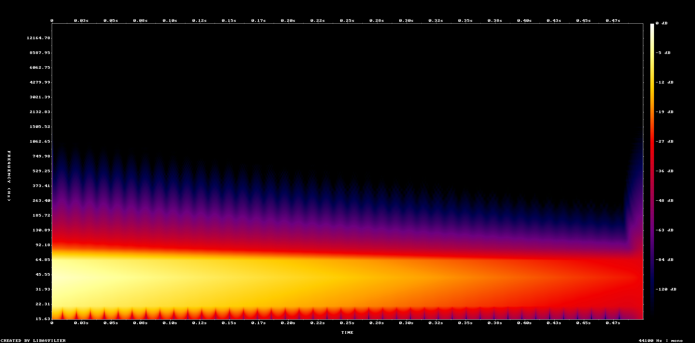
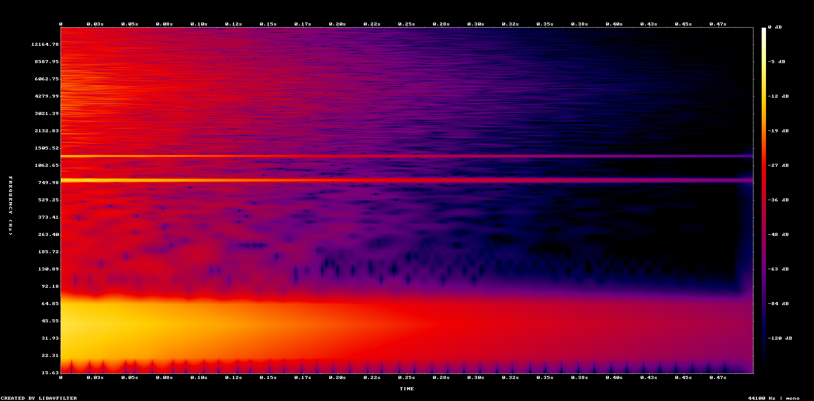

<div align="center">

# Aisinestes

### Audio your AI can actually read.

**A calibrated quality gate for audio.** It turns a WAV into visual snapshots and
pass/fail checks measured against real references — in plain text, with an exit code
you can wire into CI.


</div>

---

## Why this exists

Coding assistants can help you generate and integrate game audio, but they cannot directly
inspect the WAV file inside the same workflow. They will answer — confidently — about a
sound they never examined.

This project started with a track. The assistant composed music for the game and then
could not evaluate a single second of it. Measured later, it sat roughly 15 dB below club
reference with about twice the sub-bass it should have had — none of which was visible
from inside the workflow that produced it.

Then the same blind spot shipped. Two impact effects passed the only check in place at the
time — *"does the file contain audio?"* — and both were broken: almost all of their energy
in the sub-bass, no body, no high-frequency attack. The feedback that came back was *"they
still sound weak"*, and nothing in the loop could say why.

The AI could suggest changes. It had no reliable representation of what was actually inside
the file. **Aisinestes was built to provide that missing representation** — and the first
thing it did was fix that track. The numbers are further down, including the one that got
*worse*.

*(Full story: [docs/ai-development-process.md](docs/ai-development-process.md).)*

```
   WAV file
      ↓
  Aisinestes
      ↓
  waveform + spectrogram + calibrated checks
      ↓
  AI-assisted diagnosis  or  CI decision
```

> *The name comes from **synesthesia**: perceiving one sense through another.
> Seeing sound, instead of hearing it.*

---

## What it looks like

The same command on a broken impact and a healthy one:

| Broken impact | Healthy impact |
|---|---|
|  |  |
| **3 of 4 checks flagged** | **no checks flagged** |
| everything crammed below 90 Hz, silence above | sub, body at 800/1300 Hz, and bite up top |

The spectrogram is deliberately built to be **looked at** — logarithmic frequency axis,
labelled dB scale, no decorative gradients. When the numbers say "something is wrong in
the low mids", the image shows you where.

---

## Quick example

```bash
python -m aisinestes impact_01.wav --genre fx-impact
```

```
  status  check                            measured           target
  ------  -------------------------------  -----------------  --------------------------------
  FLAG    Sub magnitude (20-60 Hz)         98.89 %            <= 60.00 %
  FLAG    Body magnitude (120-2000 Hz)     0.06 %             >= 5.00 %
  FLAG    Bite magnitude (2000 Hz and up)  0.13 %             >= 0.16 %
  OK      Fast attack (envelope peak)      0.000 of duration  <= 0.15 of duration (first 15 %)

  RESULT: 3 FLAG of 4 checks.
```

It works on music too:

```bash
python -m aisinestes track.wav --genre techno-club
```

```
  OK      Sub magnitude (20-60 Hz)        25.64 %      18.00 to 26.00 %  (reference ≈ 22 %)
  OK      Sub+bass magnitude (20-120 Hz)  48.98 %      48.00 to 52.00 %
  FLAG    Integrated loudness (LUFS-I)    -12.10 LUFS  -8.00 to -6.00 LUFS
  FLAG    Loudness range (LRA)            0.10 LU      5.00 to 8.00 LU
  OK      True peak                       -1.10 dBFS   <= -1.00 dBFS
```

Both flags are actionable: the track is 4 dB quieter than club reference, and it is
dynamically flat. You know what to fix before opening a DAW.

### A real before and after

The same track, measured before and after a round of corrections driven by these numbers:

| metric | before | after | reference |
|---|---:|---:|---|
| sub (20–60 Hz) | 42.25 % 🚩 | **25.64 %** ✅ | 18–26 % |
| sub+bass (20–120 Hz) | 52.21 % 🚩 | **48.98 %** ✅ | 48–52 % |
| integrated loudness | −22.70 LUFS 🚩 | **−12.10 LUFS** 🚩 | −8 to −6 |
| loudness range | 0.80 LU 🚩 | **0.10 LU** 🚩 | 5–8 |
| | *4 of 5 flagged* | *2 of 5 flagged* | |

The spectral balance was the target and it moved into range. Loudness improved by 10.6 LU
and still flags.

**And one metric got worse.** Pushing the level flattened the dynamics further — the
loudness range fell from 0.80 LU to 0.10. Nobody noticed at the time; the tool did, on a
later measurement. That is the argument for the whole project in one line: an unmeasured
fix is a guess about which trade you just made.

---

## What you get

```
out/<filename>/
├── report.txt        the readable verdict shown above
├── report.json       every raw metric, for machines
├── spectrogram.png   log-frequency, ~15 Hz-13 kHz, honest dB legend   (needs ffmpeg)
└── waveform.png      full waveform                                     (needs ffmpeg)
```

Without `ffmpeg` you still get both reports and every spectral check; you lose the two
images and the EBU R128 loudness metrics.

---

## Use it as a gate

| exit code | meaning |
|:---:|---|
| `0` | everything measured, no flags |
| `1` | at least one flag, or a metric couldn't be measured |
| `2` | couldn't produce a report at all |

```bash
# fail the build if any new sound effect is broken
for f in assets/sfx/*.wav; do
  python -m aisinestes "$f" --genre fx-impact || exit 1
done
```

Measurable technical failures get caught before subjective review, and every flag says
what to inspect.

---

## What makes it different

- **It returns calibrated checks, not unexplained raw metrics.** `25.64 % sub` means
  nothing on its own; `25.64 %, target 18–26 %` is a decision. Given a bare number with no
  reference, a language model will confabulate a confident opinion about it.
- **It supports short game sound effects, not only full music tracks.** Impacts fail in
  ways a music profile cannot see.
- **It can be used as a command-line quality gate**, with an exit code and no interactive step.
- **Its test suite includes explicit negative cases that must fail.** Seventeen of the
  thirty-four cases exist purely to prove the other seventeen aren't lying.

---

## Profiles

| profile | for | checks |
|---|---|---|
| `fx-impact` | hits, impacts, one-shots | sub ceiling, body floor, bite floor, attack speed |
| `techno-club` | club-oriented electronic music | sub range, sub+bass range, LUFS-I, LRA, true peak |
| *(none)* | anything | measures everything, judges nothing |

Adding a profile is a dictionary in `targets.py` — see
[docs/adding-profiles.md](docs/adding-profiles.md).

---

## Install

```bash
git clone https://github.com/D-Unit-7/Aisinestes.git
cd Aisinestes
python -m aisinestes your_audio.wav --genre fx-impact
```

That is the whole installation — there is no `pip install` step because there are no
third-party Python packages to install.

**Requirements**

- Python 3.11+ *(developed and tested on 3.13)*
- Tested on Windows. Nothing in the code is platform-specific, but other platforms have
  not been verified.
- `ffmpeg` **optional** — enables the spectrogram, the waveform and EBU R128 loudness
  (LUFS-I, LRA, true peak). Everything else works without it.

If `ffmpeg` isn't on your PATH:

```bash
export AISINESTES_FFMPEG=/path/to/ffmpeg      # Windows: set AISINESTES_FFMPEG=C:\...\ffmpeg.exe
```

---

## Tests

```bash
python harness/run_harness.py
```

```
SUMMARY: 34 cases in 3.8 s -> PASS=34
EXIT 0 (all PASS)
```

Each positive detector test has a corresponding negative case that must fail — and the
suite verifies that it actually fails. A detector that cannot be made to fail isn't
detecting anything. The ten WAV fixtures are generated from code (sine waves, filtered
noise, exponential decays) and can be recreated bit for bit; no samples, no licences,
nothing borrowed.

Details: [docs/testing-strategy.md](docs/testing-strategy.md).

---

## Documentation

| document | what's in it |
|---|---|
| [measurement-methodology.md](docs/measurement-methodology.md) | magnitude vs power, FFT, window, hop, frame sampling, bands |
| [calibration.md](docs/calibration.md) | how the thresholds were derived, and what that does and doesn't prove |
| [testing-strategy.md](docs/testing-strategy.md) | positive and negative cases, synthetic signals, cross-checks |
| [design-rules.md](docs/design-rules.md) | the hard rules the code follows, and the failure behind each one |
| [adding-profiles.md](docs/adding-profiles.md) | how to add a genre profile |
| [references.md](docs/references.md) | where each reference value comes from — including what is still undocumented |
| [ai-development-process.md](docs/ai-development-process.md) | how this was built with AI assistance |

---

## Limitations

Stated plainly, because a tool that judges should be judged back:

- **WAV only** (PCM 16/24/32-bit and IEEE float32). No MP3, no FLAC.
- **Two calibrated profiles.** Broad genre coverage is not the goal; calibrated coverage is.
- **BPM is an estimate**, reported as such and never used as a check.
- **The thresholds are calibration baselines, not universal audio standards.** They were
  derived from a 105-sound reference set; independent validation against a separate
  labelled dataset is planned and has not been done. See
  [docs/calibration.md](docs/calibration.md).
- **The `techno-club` reference values still need their primary sources documented.** See
  [docs/references.md](docs/references.md).
- It evaluates measurable spectral and dynamic properties. It cannot tell you whether a
  sound is *good* — only whether it matches the reference you asked it to match.

---

## Authorship and AI assistance

Aisinestes was developed with substantial AI assistance.

The repository owner identified the original problem, defined the product requirements,
selected the expected outputs, tested the tool with real project audio, reviewed its
behaviour, requested corrections, and made the final product and calibration decisions.

Claude assisted heavily with implementation, technical research, test construction and
documentation.

This repository is presented as an AI-directed and human-validated development project,
not as evidence that every line was written manually by its owner. The process is
documented in [docs/ai-development-process.md](docs/ai-development-process.md).

## Licence

MIT — see [LICENSE](LICENSE).

The ten test signals are generated by the included code and carry no third-party rights.
The `fx-impact` profile was calibrated by measuring sounds from
[Kenney's](https://kenney.nl/) public-domain library; no audio from it ships in this
repository.
